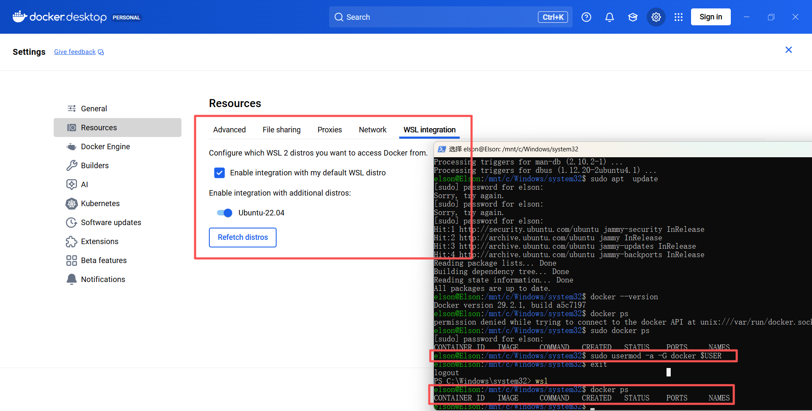
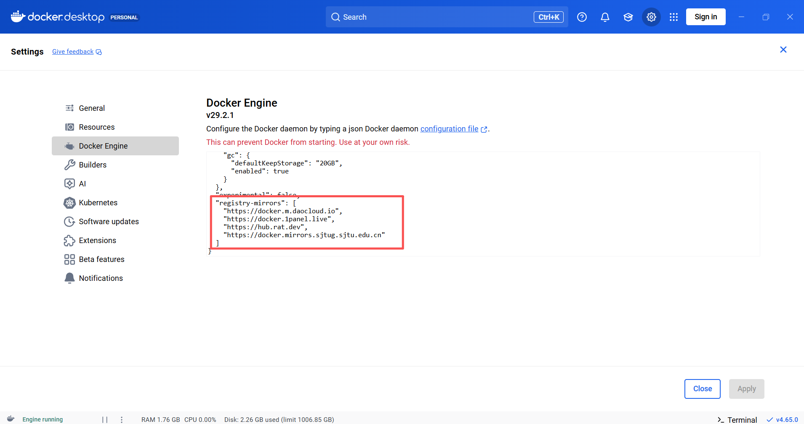
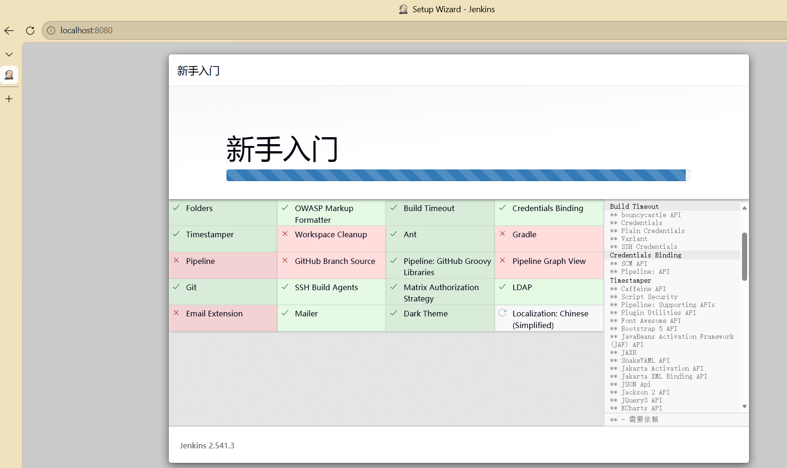
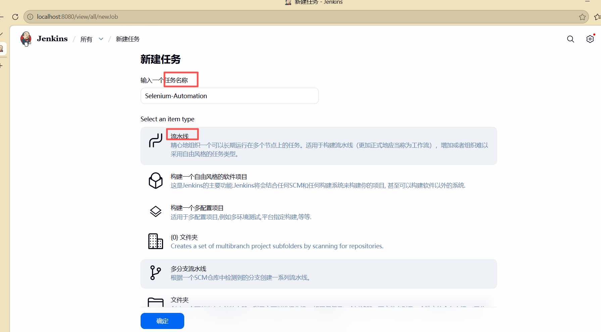
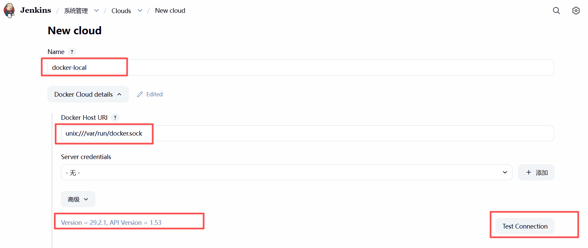
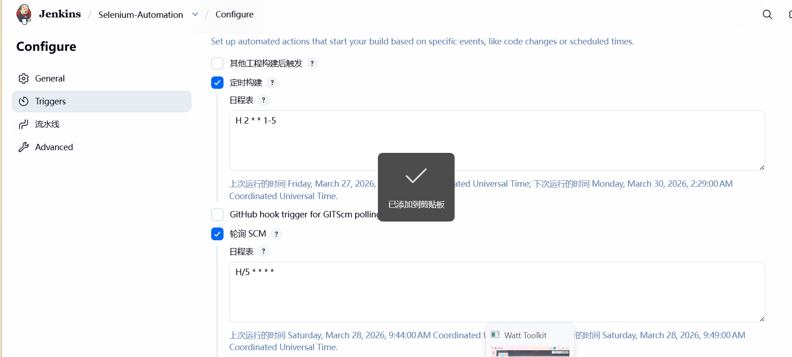
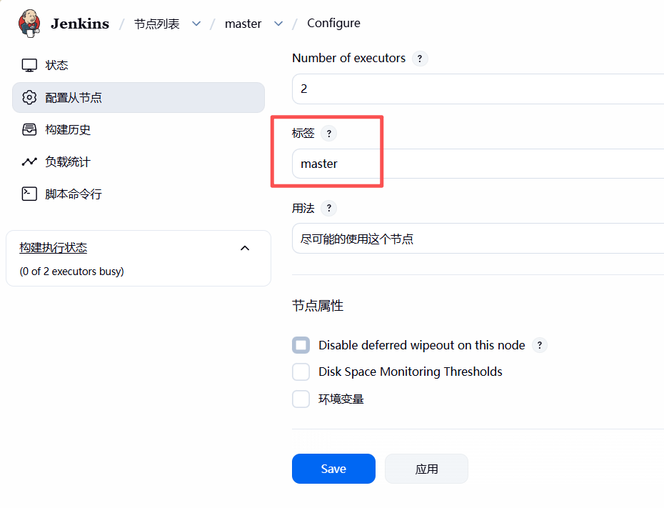
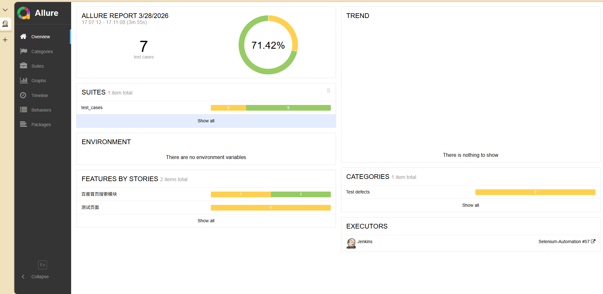
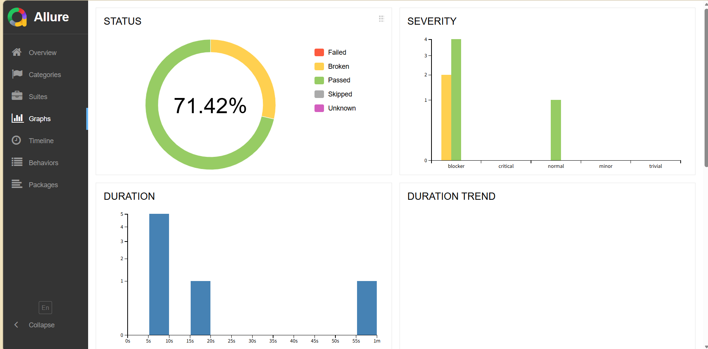

### Docker&dockerfile

##### 1. 自动化docker常用指令：

dockerfile: 类比构造函数; 文本文件定义如何构建镜像（安装依赖, 复制代码等）; 源码用于构建image

Image: 类比类; 只读模板，包含操作系统+python+代码; image模板用于container实例

container: 类比实例; 镜像的运行态, 一个镜像可以跑多个运行态

docker是进程级别的隔离，以及环境不一致的问题，是生产 Image 的标准化工厂（CI/CD 流水线用）；而 写Dockerfile 是为了打包测试环境。

```python
1. 镜像管理(Image)
    docker pull <镜像> : 拉去测试环境; eg: docker pull selenium/standalone-chrome:latest
    docker images : 查看本地拥有的镜像; eg: docker images | grep selenium
    docker rmi <image_id> : 删除指定镜像; eg: docker rmi abc123
    docker save -o xxx.tar <镜像> : 导出到指定镜像到指定位置同时命名(离线传输); eg: docker save -o selenium.tar selenium/standalone-chrome
    docker load -i xxx.tar : 导入镜像(内网传输); eg: docker load -i selenium.tar

2. 容器(Container; 实例具体唯一的)生命周期:
    1. 创建并启动: docker run 
        参数: 
        1. -d后台
        2. -p宿主机:容器 端口映射(单向: 宿主机 ---> 容器)
        3. -v宿主机:容器 挂载(实时双向同步变化)
        4. --name 给容器命名
        5. --rm 用完即删除
        eg: docker run -d -p 4444:4444 -v /dev/shm:/dev/shm --name selenium-hub/standalone-chrome
        容器名字必须唯一
    2. 启动: docker run
        format: docker start <name>
        eg: docker start selenium-hub 唤醒休眠的容器
    3. 停止: docker stop
        format: docker stop <name>
        eg: docker stop selenium-hub -t 10 -t是等待10s强制杀死; 没有-t是优雅关闭保存状态
    4. 重启: docker restart
        format: docker restart <name>
        eg: docker restart selenium-hub
    5. 删除: docker rm
        format: docker rm <name>
        eg: docker rm selenium-hub -f是强制删除, -v是连带卷一起删除, 连卷一起删除就是真的啥也没有了

3. 容器操作 (调试 | 监控) 
    1. 看日志: docker logs <container_name>
        eg: docker logs -f --tail 100 selenium-hub 实时查看selenium-hub容器的最后100行日志
    2. 进容器内部: docker exec -it <container_name> bash
        eg: docker exec -it selenium-hub bash 进入容器内部查看chromedriver是否再运行;
        -i interactive(交互式); -t tty(伪终端); bash使得不退出, 保持登录状态, 除非exit;
    3. 查看详情: docker inspect <container_name>
        eg: docker inspect selenium-hub | grep IPAddress 查看容器IP, 将用于配置测试脚本
    4. 复制文件 docker cp container:路径 宿主机路径
        eg: docker cp selenium-hub:/var/log/selenium.log ./logs. 将指定容器内的日志拷贝至宿主机

4. 资源监控(排查性能问题)
    1. docker ps 查看运行中的容器; 类似ps -aux
    2. docker ps -a 看所有容器(含已停止); 类似 ps -aux含僵尸进程
    3. docker stats 实时查看容器 cpu/memory; 类似vmstat/top
    4. docker top <name> 查看容器内的进程; 类似top
      
5. 数据持久化(Volume)
    1. docker volume ls 查看全部数据卷, 容器删除, 卷还在
    2. docker volume rm <volume_name> 删除指定卷
    3. docker run -v 宿主机:容器 挂载

6. 网络(多容器协作)
    1. docker network ls 查看网络 bridge/host/none
    2. docker network create net-test 创建测试专用网络
    3. docker run --network net-test 指定容器加入网络(容器间互访)

7. 清理(磁盘满了急救)
    1. docker system df 查看docker占用多少磁盘
    2. docker system prune 删除所有未使用的数据(容器, 网络, 镜像, 卷) 很危险
    3. docker system prune -a 连带删除所有未运行的容器镜像 最危险
    4. docker container prune 只删除已停止的容器 
    5. docker volume prune 只删除未使用的卷 

8. 构建(dockerfile)
    1. docker build -f -t 镜像名:标签 . ; 构建指定当前目录的dockerfile; . 是要构建镜像的位置。
       只是会将文件中提到的内容打成镜像，文件从当前路径开始获取。会存在实际物理路径
    2. docker build --no-cache -f dockerfile.test -t mytest:v1 . 不用缓存, 强制重新构建;-f 文件 -t 打仓库名:标签(默认latest)
'''

'''
Dockerfile 构建镜像便于后续容器使用时, 更加快速方便; 便于分享, 环境一致; 
Docker专用指令(DSL语法), 每条指令会创建一个新的只读层:
    指令        本质            作用                                       创建层
    FROM        基础声明        指定地基(基于那个镜像生成)                  是(第0层)  
    RUN         执行指令        装修房子(linux指令)                        是(每RUN就会创建一层)
    COPY        文件复制        搬家具(把宿主机文件拷贝进镜像)               是(创建新层)                  
    WORKDIR     路径声明        工作路径设置(设置工作目录位置)               是(元数据层)
    CMD         启动命令        入住后的默认活动(容器启动时执行的命令)        是(最后一层,可覆盖)
    ENV         环境变量        设置环境变量(构建运行都生效)                                
    ARG         构建参数        仅构建时可用，类似变量
    ADD         解压            自动解压tar包
    EXPOSE      声明端口         只是文档，实际映射用-p
    VOLUME      挂载点           数据持久化
    ENTRYPOINT                  固定执行体
    LABEL                       镜像标签信息


eg:
    # 环境配置
    ENV PATH="/opt/allure/bin:${PATH}"    # 设置环境变量（构建和运行都生效）
    ARG VERSION=2.24.0                   # 构建参数（仅构建时可用，类似变量）

    # 文件操作（COPY 的升级版）
    ADD allure.tgz /opt/                 # 自动解压 tar 包（COPY 不会解压）

    # 网络和存储
    EXPOSE 8080                          # 声明端口（只是文档，实际映射用 -p）
    VOLUME ["/data"]                     # 挂载点（数据持久化）

    # 执行控制（CMD 的搭档）
    ENTRYPOINT ["python"]                # 固定执行体（不可覆盖）
    CMD ["app.py"]                       # 默认参数（可覆盖）
    # 组合效果：docker run 时执行 python app.py

    # 元数据
    LABEL maintainer="you@email.com"     # 镜像标签信息

注意:
    RUN：构建时执行（docker build 时运行，结果保存到镜像）
    CMD：运行时执行（docker run 时才运行，不保存结果到镜像）
    "同层下载同层删，合并 RUN 省空间；多阶段构建最优雅，生产环境必用它"

    
结构:
    Container Layer（可写层，运行时产生，如日志、临时文件）
        ↑ 容器在这里读写
    Layer 5（CMD 元数据）← 最顶层，最新
    Layer 4（pip 安装的包）
    Layer 3（requirements.txt）
    Layer 2（gcc 编译器）
    Layer 1（apt 缓存）← 问题层！即使删除，这里还占着空间
    Layer 0（基础镜像 python:3.12）← 最底层，最早

口诀:
    层结构口诀：
    0 在地基，5 在房顶，容器住阁楼（最上面）
    找文件从上到下，找到即停，上层盖下层
    合并 RUN 口诀：
    下载解压删除要一行，apt 装完记得清缓存
    分开写是千层饼（每层都占地方），合并写是压缩包（只留最终结果）
'''

'''
1. 一个镜像可以构建多个功能相同的容器，功能相同，但是可以做不一样的任务
    // 同一个镜像，不同参数
    docker run auto-test:v1 pytest test_login.py  # 容器A：测登录
    docker run auto-test:v1 pytest test_pay.py    # 容器B：测支付

2. 一个jenkins最多使用容器数量可以限制，而不是一个项目最多使用个数，每个容器的功能可以相同，也可以不同

3. 容器之间是同级别

4. agent是被master分配任务才创建，不是放在一个池中等待使用

5. 一个创建的agent就是container就是电脑

6. 在jenkins中可以配置，pipeline脚本，会启动另一个容器

'''

'''
测试理论：
    冒烟测试：测试最核心的几个功能，如果核心都跑不起来，就没必要进行后续深度的测试。
    自动化关联：通常放在CI/CD的第一步，写上5-10条核心用例

    负载测试：测试系统预期最大负载情况下的表现
    压力测试：测试系统在极限/超载下的崩溃点和恢复能力
    自动化关联：用工具如 Locust、JMeter、k6 编写脚本模拟并发，配合你之前学的 shell 监控命令（vmstat、iostat）实时观察 CPU/内存。

    按开发阶段划分：
    类型	    英文	            说明
    单元测试	Unit Test	        函数/方法级别验证，pytest 的主力战场
    集成测试	Integration Test	验证模块间接口（如你的 POM 框架中 Page 类与业务层的交互）
    系统测试	System Test	        完整功能验证，端到端（E2E）
    验收测试	UAT / Acceptance	用户/产品方确认符合需求
    回归测试	Regression	        修改代码后重跑历史用例，确保未引入新 Bug


'''

'''
    WSL + Docker Desktop + Jenkins 的权限机制：
        Docker Desktop 在 Windows 侧运行 Docker 引擎，并通过 WSL 集成在 Ubuntu 中暴露 /var/run/docker.sock（Unix Socket 接口）。
        这个 Socket 文件是 Docker 的"遥控器"：拥有读写权限 = 可以执行任意 Docker 命令（创建容器、删除镜像等）。
        权限限制：Socket 默认属于 root:docker（GID 可能是 998/1001 等），普通用户无法访问。
        --group-add $(stat -c '%g' ...) 的作用：
        动态查询宿主机上 docker 组的 GID
        容器启动时，将内部的 jenkins 用户临时加入该 GID 的组
        使 jenkins 用户获得对 socket 的读写权限
        结果：Jenkins 容器内可以执行 docker build、docker run，实际由 Windows 的 Docker Desktop 完成底层操作，实现"容器内控制容器"（Docker in Docker）。
'''
```

##### 2. 安装部署

在windows环境下，通过安装wsl(windows subsystem for linux)内核可以让docker这个小汽车发挥更好的性能。

wsl和windows分别安装docker目的分别是c/s服务，wsl作为client，而windows作为server

- ##### 前置配置：让 WSL 连上 Windows 的 Docker

让docker desktop与wsl连接



- ##### 启动 Jenkins 容器

jenkins是一个CI/CD工具，用于把测试自动化的嵌入到开发过程中，是负责串联自动化步骤的中央调度器（智能控制执行步骤），**"测试自动执行器 + 报告生成器 + 团队协作中枢"**。

CI(continuous itegration)：持续集成，把提交的代码自动编译、打包、运行测试。

CD(continuous delivery/deployment)：持续交付/部署，测试通过后自动发布到测试环境或生产环境。

实际工作流程示例：

```bash
# 开发提交代码到 GitHub/GitLab
git push origin main

# Jenkins 自动触发 Pipeline：
1. 拉取最新代码（既有开发产品的代码，又有测试代码）
2. 构建 Docker 镜像（包含你的 pytest 环境）
3. 运行容器执行测试：pytest test_cases/ --alluredir=./allure-results
4. 生成 Allure 报告并归档
5. 发送钉钉/邮件通知：本次构建 20 条用例通过，2 条失败（附链接）
6. 如果测试通过，自动部署到测试环境；失败则阻止部署
测试代码是"考官"，产品代码是"考生"，测试环境是"考场"，生产环境是"正式舞台"。Jenkins 负责把"考生"送到"考场"考试，通过了再送到"舞台"表演。
测试代码是脚本（pytest文件），测试环境是服务器（运行产品（产品代码）的机器）。Jenkins 部署的是产品代码，不是测试代码。
```

| 测试类型                | 测什么                  | 工具                       | 你的 pytest 里的例子                                      |
| ----------------------- | ----------------------- | -------------------------- | --------------------------------------------------------- |
| **API 测试** (接口测试) | HTTP 接口（后端逻辑）   | `requests` 库、Postman     | `requests.get("http://api/login", json={"user":"admin"})` |
| **UI 测试** (E2E 测试)  | 浏览器页面（前端+后端） | Selenium、Playwright       | `driver.find_element(By.ID, "login").click()`             |
| **单元测试**            | 单个函数/类             | `pytest` + `unittest.mock` | `assert add(1,2) == 3`                                    |

```bash
开发提交代码
    ↓
单元测试（本地函数级）→ 集成测试（模块级）→ [部署到测试环境] 
    ↓
API 测试（接口级）→ UI 测试（你的 Selenium，用户级）
    ↓
部署到生产环境
```

| 阶段        | 名称         | 谁写       | 测什么                               | 是否需要部署                    |
| ----------- | ------------ | ---------- | ------------------------------------ | ------------------------------- |
| **第 1 层** | **单元测试** | 开发       | 单个函数/类（如 `calculator.add()`） | ❌ 不需要，本地直接跑            |
| **第 2 层** | **集成测试** | 开发/测试  | 模块间交互（如数据库连接、Redis）    | ❌ 通常用内存数据库（H2/SQLite） |
| **第 3 层** | **API 测试** | 测试（你） | HTTP 接口（REST API）                | ✅ **首次部署到测试环境**        |
| **第 4 层** | **UI 测试**  | 测试（你） | 完整用户流程（登录→搜索→下单）       | ✅ **测试环境已运行**            |

- **测试环境** = 部署**产品代码**的目标机器（服务器）
- **Jenkins** = 执行**测试代码**的调度器（运行你的 pytest 脚本）
- **Git** = 存储**测试代码**的仓库（Jenkins 从这里拉取）

```bash
Git 仓库（测试代码） 
    ↓ Jenkins 拉取
Jenkins 服务器（执行 pytest）
    ↓ HTTP/WebDriver 调用
测试环境服务器（运行产品）

触发时机：
开发提交产品代码 → Jenkins 自动拉取最新测试代码 + 部署产品 → 跑你的脚本
你提交测试代码 → Jenkins 验证脚本本身是否能跑通（冒烟）
```

##### 个人总结：

jenkins从git仓库中被触发，由于开发或者测试代码的提交；对开发提交的代码进行编译、单元测试、集成测试，最后测试通过部署到测试环境；而对测试提交的代码会触发对测试环境进行API测试和UI测试、不会进行部署到生产环境。最终的生产部署权在产品经理和运维手中，他们要基于产品代码测试结果。

**测试提交和开发提交都会触发 CI，但前者是验证脚本正确性，后者是验证产品功能，两者都不会直接触发部署到生产环境。**

```bash
docker run -d \	# 后台运行
--name jenkins \ # 对容器命名
-p 8080:8080 \	# 端口映射，不用宿主机和容器端口一致，已使用不可再使用；web使用
-p 50000:50000 \	# agent通信使用，一个服务功能对应一个port
-v ~/jenkins_home:/var/jenkins_home \	# 卷映射，可以写一个，但是容易脏；多个实现功能分离。
# Jenkins 配置、插件、Job 定义此时宿主机是wsl；宿主机 wsl ubuntu=命令中的宿主机
-v /var/run/docker.scok:/var/run/docker.sock \	# docker的权限控制，宿主机是docker desktop的转发；于上一指令宿主机不是同一个。wsl 底层=docker引擎的宿主机
--group-add $(stat -c '%g' /var/run/docker.sock) \ # 动态精准获取该文件的组id且将jenkins添加进去，赋权
jenkins/jenkins:lts	# 基于的jenkins镜像基础上实现容器，是将远程镜像拉至docker本地仓库
# -v 容器删除，配置还在。便于再次运行
```

##### 换源：



docker desktop 提供docker，wsl在windows下，为docker容器提供宿主机，在linux基础上，创建docker容器性能更好。

##### 总结：

WSL2 为 Docker Desktop 提供了 Linux 内核运行环境，Docker 引擎是docker desktop的一部分，还有docker cli、docker compose，但需要linux环境，因此跑在 WSL2 里，容器跑在 Docker 引擎上。

docker desktop常用他的其中的GUI 看状态，适合可视化；WSL是用命令行操控Docker，适合自动化脚本；两者操作的是同一套容器，数据存在WSL2的虚拟磁盘中。

##### 获取初始管理员密码

```bash
docker logs -f jenkins
# 等待看到 "Jenkins is fully up and running" 后，Ctrl+C 停止日志跟踪

# 获取密码
docker exec jenkins cat /var/jenkins_home/secrets/initialAdminPassword
# 复制这串字符（如：a1b2c3d4...）
```

##### 启动jenkins网页管理



##### 新建pipeline(流水线)



- ###### 点击左侧"流水线"

在左侧菜单点击 **"流水线"**（或 Pipeline），进入 Pipeline 配置区域。

- ###### 按文档要求填写（关键配置）

表格

| 配置项                | 选项/填写内容                                          | 说明                                                      |
| :-------------------- | :----------------------------------------------------- | :-------------------------------------------------------- |
| **Definition**        | `Pipeline script from SCM`                             | 从 Git 仓库读取 Jenkinsfile                               |
| **SCM**               | `Git`                                                  | 版本控制工具                                              |
| **Repository URL**    | `https://gitee.com/ElsonComing1/selenium-learning.git` | ⚠️ **注意**：由于 GitHub 连不上，请改为 Gitee 地址（码云） |
| **Credentials**       | 选择 `无`（如果是公开仓库）或添加用户名密码            | Gitee 公开库可以不填                                      |
| **Branches to build** | `*/main`                                               | 构建 main 分支（或你的默认分支）                          |
| **Script Path**       | `Jenkinsfile`                                          | 仓库根目录下的 Jenkinsfile 文件名                         |

- ###### 立即保存前的检查清单

##### 镜像文件

dockerfile

```txt
# FROM python:3.12-alpine
# # FROM可以小写，但是强烈建议大写。FROM是dcokerfile指令;强烈建议大写原因: 便于辨别指令和参数
# # FROM生命基础镜像，站在谁的肩膀上运行

# RUN apk add --no-cache bash gcc musl-dev linux-headers
# # RUN 执行命令一次, 每执行一次, 镜像增加一层。是叠加，而不是包裹。
# # apk add 类似 apt-get install 参数 --no-cache 不留缓存，减小镜像体积, 安装bash shell、C编译器、AIpine的C库开发文件、linux内核头文件
# # 安装以上库的原因是: selenium pandas 等python库，需要有底层C的扩展，需要编译环境；编译 执行

# WORKDIR /app
# # 类似linux的cd 切换目录，但是具有创建且切入的作用
# # 只创建，不切入的指令有么？

# COPY requirements.txt .
# # 赋值宿主机上的文件至当前工作目录(app)下; app/requirements.txt

# RUN pip install --no-cache-dir -r requirements.txt
# # --no-cache-dir 不保留pip缓存，减小镜像体积
# # -r 从文件读取列表
# # 这是在容器内执行，安装好的库会保存在镜像中，不是在windows上

# RUN apk add --no-cache openjdk11-jre curl unzip \
# && curl -o allur.tgz -Ls https://github.com/allure-framework/allure2/releases/download/2.24.0/allure-2.24.0.tgz \
# && tar -zxvf allure.tgz -C /opt/ \
# && ln -s /opt/allure-2.24.0/bin/allure /usr/bin/allure \
# && rm allure.tgz
# # && 前一个指令成，后一个指令才会执行
# # curl -o 保存位置 -Ls(动态跟随，静默) url 
# # ln -s(soft) 路径 被link路径 

# COPY . .
# # 赋值宿主机当前目录 至 容器内

# CMD ["pytest","test_cases/TestBaiduPOM.py","-v","--alluredir=./allure-results"]
# # docker运行指令

# # Windows 宿主机（你的电脑）
# #     ↓
# # docker run my-image    ← 你输入这条命令
# #     ↓
# # Docker 引擎启动容器
# #     ↓
# # 容器内部（Linux 环境，Alpine 系统）
# #     ↓
# # 执行 CMD：pytest test_cases/TestBaiduPOM.py...
# #     ↓
# # 生成 allure-results 在容器内（/app/allure-results）


# # 分层是为了缓存，前面没变的直接使用，不需要再构建，多个项目也可以公用没变的层；
# # 正常情况下是一个指令一层，FROM是引用文件多层。
# # 创建层的指令：文件操作 RUN COPY ADD 修改文件系统，创建主要层，体积大；元数据 ENV WORKDIR USER VOLUME EXPOSE LABEL CMD ENTRYPOINT 修改镜像配置，创建元数据层，体积小
# # 不创建层：基础引用 FROM 只是引用基础镜像的层，不添加。构建参数 ARG 仅在构建参数存在，不进入最终镜像

# # 配合 .dockerignore 文件可以排除不需要的文件（如 report/、__pycache__/、allure-results/），减小镜像体积。


# 基础镜像（Debian系，apt管理）
FROM python:3.12-slim

# 1. 换国内apt源 + 安装基础工具（含 Java 21）
# 注意：Debian 12/13 使用 deb822 格式，原文件路径不同，需重建 sources.list
RUN CODENAME=$(awk -F= '/VERSION_CODENAME/{print $2}' /etc/os-release) && \
    rm -f /etc/apt/sources.list.d/debian.sources && \
    echo "deb http://mirrors.tuna.tsinghua.edu.cn/debian/ ${CODENAME} main contrib non-free non-free-firmware" > /etc/apt/sources.list && \
    echo "deb http://mirrors.tuna.tsinghua.edu.cn/debian/ ${CODENAME}-updates main contrib non-free non-free-firmware" >> /etc/apt/sources.list && \
    echo "deb http://mirrors.tuna.tsinghua.edu.cn/debian-security ${CODENAME}-security main contrib non-free non-free-firmware" >> /etc/apt/sources.list && \
    apt-get update && \
    apt-get install -y wget unzip gnupg2 chromium chromium-driver openjdk-21-jre-headless && \
    rm -rf /var/lib/apt/lists/*

# 2. 安装Allure（使用本地 COPY，避免网络问题）
# 提前在本地执行：curl -L -o allure-commandline-2.24.0.tgz "https://maven.aliyun.com/repository/public/io/qameta/allure/allure-commandline/2.24.0/allure-commandline-2.24.0.tgz"
COPY allure-commandline-2.24.0.tgz /tmp/
RUN tar -zxf /tmp/allure-commandline-2.24.0.tgz -C /opt/ && \
    ln -sf $(find /opt -maxdepth 1 -type d -name "allure-*")/bin/allure /usr/bin/allure && \
    rm -f /tmp/allure-commandline-2.24.0.tgz && \
    allure --version

# 3. 创建Chrome软连接（只链接 google-chrome，chromedriver 已在 /usr/bin/）
RUN ln -sf /usr/bin/chromium /usr/bin/google-chrome

# 4. 复制并安装python依赖
COPY requirements.txt /tmp/requirements.txt
RUN pip3 install --no-cache-dir -r /tmp/requirements.txt -i https://pypi.tuna.tsinghua.edu.cn/simple && \
    rm -f /tmp/requirements.txt

# 5. 设置工作目录
WORKDIR /app

# 6. 默认命令
CMD ["bash"]


# # 构建步骤：
# # 1. 进入dockerfile所在目录
# cd /mnt/d/selenium-learning

# # 2. 构建镜像
# docker build -t auto-test:v1

# # 3. 验证构建成功
# docker images | grep auto-test

# # 4. 运行容器测试
# docker run -it --rm -v $(PWD):/app auto-test:v1 bash

# 进去后验证：
# allure --version
# google-chrome --version
# pytest --version
```

##### 构建镜像

镜像一次构建，多个容器快速使用

构建指令

```bash
 docker build -f dockerfile.test -t my-test:latest .
```

```bash
16531@Elson MINGW64 ~/Desktop/selenium-learning/content/day06 (main)
$ docker build -f dockerfile.test -t my-test:latest .
[+] Building 74.0s (13/13) FINISHED                                                                                                                                                          docker:desktop-linux
 => [internal] load build definition from dockerfile.test                                                                                                                                                    0.0s
 => => transferring dockerfile: 5.21kB                                                                                                                                                                       0.0s
 => [internal] load metadata for docker.io/library/python:3.12-slim                                                                                                                                          0.2s
 => [internal] load .dockerignore                                                                                                                                                                            0.0s
 => => transferring context: 189B                                                                                                                                                                            0.0s
 => [1/8] FROM docker.io/library/python:3.12-slim@sha256:3d5ed973e45820f5ba5e46bd065bd88b3a504ff0724d85980dcd05eab361fcf4                                                                                    0.0s
 => => resolve docker.io/library/python:3.12-slim@sha256:3d5ed973e45820f5ba5e46bd065bd88b3a504ff0724d85980dcd05eab361fcf4                                                                                    0.0s
 => [internal] load build context                                                                                                                                                                            0.0s
 => => transferring context: 89B                                                                                                                                                                             0.0s
 => CACHED [2/8] RUN CODENAME=$(awk -F= '/VERSION_CODENAME/{print $2}' /etc/os-release) &&     rm -f /etc/apt/sources.list.d/debian.sources &&     echo "deb http://mirrors.tuna.tsinghua.edu.cn/debian/ ${  0.0s
 => CACHED [3/8] COPY allure-commandline-2.24.0.tgz /tmp/                                                                                                                                                    0.0s
 => CACHED [4/8] RUN tar -zxf /tmp/allure-commandline-2.24.0.tgz -C /opt/ &&     ln -sf $(find /opt -maxdepth 1 -type d -name "allure-*")/bin/allure /usr/bin/allure &&     rm -f /tmp/allure-commandline-2  0.0s
 => [5/8] RUN ln -sf /usr/bin/chromium /usr/bin/google-chrome                                                                                                                                                0.3s
 => [6/8] COPY requirements.txt /tmp/requirements.txt                                                                                                                                                        0.0s
 => [7/8] RUN pip3 install --no-cache-dir -r /tmp/requirements.txt -i https://pypi.tuna.tsinghua.edu.cn/simple &&     rm -f /tmp/requirements.txt                                                           19.9s
 => [8/8] WORKDIR /app                                                                                                                                                                                       0.1s
 => exporting to image                                                                                                                                                                                      52.0s
 => => exporting layers                                                                                                                                                                                     45.0s
 => => exporting manifest sha256:1b4e899a6a6994dda264e2816a2f0006a0a909aaa2696b00a7d61a713617ac65                                                                                                            0.0s
 => => exporting config sha256:75374b8e6f3dec84da0e1b506c1e41721c231b0ff54b819e75218b391ee097cd                                                                                                              0.0s
 => => exporting attestation manifest sha256:b09f8d42e6c9388c9a8bb6b5432495718ee91b80f9da01368cd0a00f0110ec8a                                                                                                0.0s
 => => exporting manifest list sha256:3850a7d3c32c839fa813efd2866a10fb11c08da2deb1ee48497e40d3421de958                                                                                                       0.0s
 => => naming to docker.io/library/my-test:latest                                                                                                                                                            0.0s
 => => unpacking to docker.io/library/my-test:latest                                                                                                                                                         6.9s

View build details: docker-desktop://dashboard/build/desktop-linux/desktop-linux/pkes8yfu7yc2mxg5yc28u9j9k
```

##### 动态启动容器

- 安装插件

**Manage Jenkins** → **Plugins** → **Available plugins**：

搜索 `Docker Pipeline` → 安装

搜索 `Docker` → 安装（如果还没装）

目的：为了容器中的jenkins能够控制宿主机的docker，动态创建agent，通过之前的挂在-v /var/run/docker.sock:/var/run/docker.sock

- 配置cloud

**Manage Jenkins** → **Clouds** → **New Cloud**：

**名称**: `docker-local`

**Docker Host URI**: `unix:///var/run/docker.sock`

点击 **Test Connection**，应该显示 Docker 版本号（证明 Jenkins 能操作 Docker）



- 配置Agent模板（让Jenkins知道如何启动my-test）

点击 Docker Agent templates → Add Docker Template：

| 配置项                      | 值                            | 说明                                  |
| --------------------------- | ----------------------------- | ------------------------------------- |
| **Labels**                  | `my-test-agent`               | **重要**：Pipeline 里要用这个标签     |
| **Name**                    | `pytest-executor`             | 随便起个名                            |
| **Docker Image**            | `my-test:latest`              | 刚才构建的镜像名                      |
| **Remote File System Root** | `/app`                        | 必须和 Dockerfile 里的 `WORKDIR` 一致 |
| **Usage**                   | Only build jobs with label... | 只跑匹配标签的任务                    |
| **Launch method**           | Attach Docker Container       | 直接附加到容器                        |

卷挂载（Volumes）必须配置（否则代码进不去）：

点击 Container settings → Volumes → Add：

```tex
/var/jenkins_home:/var/jenkins_home	#mount
```

网络设置：

Network: bridge（默认）

定时配置：



保存

- 项目配置编写Pipeline(动态构建容器)

master管理 agent执行的分离架构

```groovy
pipeline {
    // 全局不指定 agent，每个 stage 自己选择；每一个具体的stage需要使用者自己指明节点
    agent none
    
    stages {
        stage('Master 检出代码') {
            // Master 能联网，负责下载代码
            agent { label 'master' }	// 强制在 Master 运行
            // 指定master节点
            steps {
                 // 重试 3 次，每次间隔 5 秒
                timeout(time: 2, unit: 'MINUTES') {	// 防卡死保险
                    // pipeline中的关键字是DSL（领域特定语言）不可乱写
                    retry(3) {	// 网络抖动容错
                        // 失败重试次数3
                        git(
                            url: 'git@gitee.com:ElsonComing1/selenium-learning.git',
                            // 需要获取代码的url(资源定位符)
                            branch: 'main',
                            // 指明分支获取，更精准
                            credentialsId: 'gitee-ssh-key'  // 对应上面设置的私钥;安全引用凭证	
                            // 公钥就是锁
                            // 私钥是钥匙
                            // 锁与钥匙均有我来分配，为了达到相互信任沟通。（安全）
                        )
                    }
                }
                stash includes: '**/*', name: 'source-code' // 跨节点文件传输
                // stash打包；**包括当前目录的全部层级（递归）；*该层级下的全部文件和目录
                // git clone会把仓库名selenium-learning下的内容clone进当前master的工作目录
                // 打包也是仓库下的内容
                // /var/lib/jenkins/workspace/Selenium-Automation/
            }
        }
        
        stage('Agent 执行测试') {
            // Agent 无需联网，专心执行
            agent { label 'my-test-agent' }		// 启动动态容器，用完即删
            // 需要配置docker cloud agent模版
            environment {
                DISPLAY = ':99'		// linux没有显示器，需要启动虚拟显示器
            }
            steps {
                // 从 Master 接收代码（Jenkins 内部传输，不依赖容器网络）
                unstash 'source-code'
                // /var/lib/agent/workspace/Selenium-Automation/
 				
                // 启动 Chrome + Xvfb（耗 CPU/内存）
                sh '''
                    # 清理旧的 Xvfb
                    pkill Xvfb 2>/dev/null || true
                    sleep 1
                    
                    # 启动 Xvfb（带参数确保稳定性）；启动虚拟显示器 :99
                    Xvfb :99 -screen 0 1920x1080x24 -ac +extension GLX +render -noreset > /dev/null 2>&1 &
                    sleep 2
                    
                    # 验证 Xvfb 是否启动成功
                    if ! ps aux | grep -v grep | grep Xvfb; then
                        echo "Xvfb 启动失败！"
                        exit 1
                    fi
                    
                    # 设置权限（确保所有用户可访问显示）
                    export DISPLAY=:99
                    xhost + 2>/dev/null || true		// # 允许任何用户连接（容器内单用户，无安全风险）
                '''
                
                 // 关键：彻底删除整个目录（而不是 /*），并重建
                sh '''
                    rm -rf content/day06/allure-results
                    mkdir -p content/day06/allure-results
                    
                    # 清理其他临时文件
                    rm -f content/day06/temp_result_*.xlsx
                    rm -f content/day06/*.pyc
                '''
                
                // 执行测试
                sh '''
                    cd content/day06
                    python -m pytest test_cases/ \
                        -v \
                        --alluredir=./allure-results \
                        --clean-alluredir
                        --reruns=1 \                    # 失败重试1次（网络抖动）
                        --timeout=300 \                 # 每个 case 最多5分钟
                        --headless \                    # 确保 Chrome 无头模式
                        || echo "测试有失败，但继续生成报告"
                '''
                
                // 在同一个容器内立即清理（不需要 post 阶段再开新容器）;容器用完即删还有必要清理么？
                sh '''
                    pkill Xvfb 2>/dev/null || true
                    pkill -9 chrome 2>/dev/null || true
                '''
            }
            
            post {
                    always {		// 无论成功失败都要执行
                        echo '构建结束，Agent 容器自动销毁完成清理'
                        // 在 Agent 上生成 Allure 报告（Agent 已安装 allure 命令行工具）
                        allure([
                           // 安装了插件还需要配置全局命令行工具
                            includeProperties: false,	 // 报告只显示本身值，没有jenkins属性
                            jdk: '',	// 没有值，使用系统默认的
                            results: [[path: 'content/day06/allure-results']]
                            // 告诉allure去哪里找数据拼成报告
                        ])
                    }
                }
        }
    }
    
    post {
        always {
            echo '构建结束，Agent 容器自动销毁完成清理'
        }
    }
}
```

##### 构建

github中的项目名会被jekins中的pipeline项目名顶替

需要配置DNS

需要装Allure Jenkins Plugins

全局工具设置：

Name: 填 allure（这个名字要和 Pipeline 里的一致）

Allure Commandline home: 填 /usr（因为你在 Dockerfile 里软链接到了 /usr/bin/allure，所以 home 是 /usr）
或者填 /opt/allure-2.24.0（如果你没做软链接，指向实际安装目录）

配置master标签：

pipeline groovy代码中，使用标签获取github代码



##### 结果：





