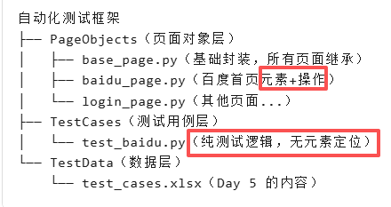

### Pytest

##### 1. 未带参数装饰器

装饰器符合开闭原则：对扩展开放（主要实现功能的函数），对修改（对主要实现功能的函数添加额外行为）封闭。装饰器就是对被装饰函数添加一些额外行为，这些行为很常用，因此被写成一个装饰函数便于其他函数使用。

```python
import functools
from datetime import datetime

'''
未带参数的装饰函数结构：

step1:
def screenshot_on_failure(func_main)

	return wraper
	
strep2:
    @functools.wraps(func_main)	# 实现主要功能函数
    def wrapper(*args,**kargs):  # 是实现主要功能函数的参数
    	try:
    		return func_main(*args,**kargs)	# 返回实现主要功能函数
    	except Exception as e:
    		raise e
step3: step2在step1里面

def screenshot_on_failuer(func_main):
	@functools.wraps(func_main)
	def wrapper(*args,**kargs):
		try:
			return func_main(*args,**kargs)	# 实现主要功能的函数不能变，因此直接返回
		except Exception as e:
			# 此处可以添加一些操作
			self=args[0]	# args[0] 第一个参数是实例本身
			timestamp=datetime.now().strftime('%Y-%m-%d_%H:%M:%S')
			file_name=f'error_{func_main.__name__}_{timestamp}.png'
			self.driver.save_screenshot(file_name)
			print(f"❌ 操作失败，已截图保存: {filename}")
			raise e	# raise 返回上层防止错误被吃掉
	return wrapper	# 此处返回的名字必须是同名
'''
```

例子未带参数截图：

```
from selenium import webdriver
from selenium.webdriver.common.by import By
from selenium.webdriver.support.ui import WebDriverWait
from selenium.webdriver.support import expected_conditions as EC
import functools
from datetime import datetime

def screenshot_on_failure(func):
    """失败自动截图装饰器"""
    @functools.wraps(func)
    def wrapper(*args, **kwargs):
        try:
            return func(*args, **kwargs)
        except Exception as e:
            # 获取 self（实例对象）
            self = args[0]
            
            # 生成截图文件名：error_方法名_时间戳.png
            timestamp = datetime.now().strftime("%Y%m%d_%H%M%S_%f")  # %f是微秒，避免重名
            filename = f"error_screenshot/error_{func.__name__}_{timestamp}.png"
            
            # 确保目录存在
            import os
            os.makedirs("error_screenshot", exist_ok=True)
            
            # 截图
            self.driver.save_screenshot(filename)
            print(f"[截图保存] 操作 {func.__name__} 失败，截图: {filename}")
            
            # 重新抛出异常（关键！不要吞异常）
            raise e
    return wrapper


class BasePage:
    def __init__(self, driver, timeout=10):
        self.driver = driver
        self.wait = WebDriverWait(driver, timeout)
    
    @screenshot_on_failure  # ← 加上装饰器！
    def find_element(self, locator):
        """查找元素（失败时自动截图）"""
        return self.wait.until(EC.visibility_of_element_located(locator))
    
    @screenshot_on_failure  # ← 加上装饰器！
    def click_element(self, locator):
        """点击元素（失败时自动截图）"""
        element = self.wait.until(EC.element_to_be_clickable(locator))
        element.click()
    
    @screenshot_on_failure  # ← 加上装饰器！
    def input_text(self, locator, text):
        """输入文本（失败时自动截图）"""
        element = self.find_element(locator)
        element.clear()
        element.send_keys(text)


class SearchPage(BasePage):
    URL = 'https://www.baidu.com'
    
    def __init__(self, driver):
        super().__init__(driver)
        self.search_input = (By.ID, "kw")
        self.search_button = (By.ID, "su")
    
    # 这个方法也继承了装饰器（因为调用了父类的 input_text）
    def search(self, keyword):
        self.input_text(self.search_input, keyword)
        self.click_element(self.search_button)
```

##### 2.  带参数装饰器

带参数的装饰器，其实就是比未带参数的装饰器多一层函数，最外层是装饰器参数，第二层参数是函数作为参数，第三层是实现主要功能函数的参数。

```python
'''
直接先写框架
step1(带参数):
def screenshot_on_failur(folder='error_screenshot',enabled=True)	# 使用关键字参数带有默认值

	return decorate
step2(装饰器):
	def decorate(func_main):	# 不带参数此处就直接起名：见名知义;由于带参数，所以此处的名字需要与step1的返回变量名一致
	
		reurn wrapper
step3(包装):
		@functools.wraps(func_main)
		def wrapper(*args,**largs):	# 此处的函数名需要与step2的返回变量名同名
			try:
				return func_main(*args,**kargs)	# 返回主要功能函数
			except Exception as e:
				
				raise e
'''
```

自定义目录或者是否截图：

```python
import functools,datetime,os

def screenshot_on_failure(folder="error_screenshot", enabled=True):	# setp1:带参数
    """带参数的装饰器工厂"""
    def decorator(func):	# step2:装饰器
        @functools.wraps(func)
        def wrapper(*args, **kwargs):	# step3:包装
            if not enabled:  # 可以关闭截图功能
                return func(*args, **kwargs)
            
            try:
                return func(*args, **kwargs)
            except Exception as e:
                self = args[0]
                timestamp = datetime.now().strftime("%Y%m%d_%H%M%S")
                filename = f"{folder}/error_{func.__name__}_{timestamp}.png"
                
                import os
                os.makedirs(folder, exist_ok=True)
                self.driver.save_screenshot(filename)
                print(f"[自动截图] {filename}")
                raise e
        return wrapper
    return decorator


class BasePage:
    @screenshot_on_failure(folder="screenshots/login", enabled=True)
    def click_login(self):
        pass
    
    @screenshot_on_failure(enabled=False)  # 这个操作不截图
    def get_title(self):
        return self.driver.title
```

##### 3.  创建时序

我明白了，同级别，先写的先执行（按顺序），类中定义的变量分为实例变量，和类变量（类内部的块级别），实例变量需要实例化才会执行，类变量是直接定义（可供内外执行），装饰就像调用，遇见就即可执行。
至于if \_\_name\_\_=='\_\_main\_\_'只有单独运行该文件才会执行。

```
模块级代码 → 遇到类/函数定义 → 类/函数内部立即执行（装饰器、类变量）
→ 定义完成后继续模块级代码 → 最后才到 if __name__ == '__main__'
```


```python
# ==========================================
# 文件: execution_order_demo.py
# 运行方式: python execution_order_demo.py
# ==========================================

print("【第一步-1】模块级代码开始执行 - 文件被读取")

# 模块级变量定义（第一步）
module_var = "我在模块级别定义"
print(f"【第一步-2】定义模块变量: {module_var}")

# 模块级函数定义（第一步 - 只定义不执行函数体）
def module_function():
    print("    我是函数内部，只有被调用时才执行（现在没调用）")
print("【第一步-3】定义了函数 module_function（但函数体未执行）")

print("\n===== 即将进入类定义（类装饰器会立即执行！） =====\n")

# ==========================================
# 【第一步-4】Python 看到 class 关键字，开始"建造"类
# ==========================================
class MyClass(object):
    # 【第二步】类体内部代码在类定义时立即执行！
    print("【第二步-1】类体内部代码开始执行（类定义时）")
    
    # 类属性（类定义时赋值）
    class_attr = "类属性"
    print(f"【第二步-2】定义类属性: {class_attr}")
    
    # 【第二步-3】类装饰器/装饰器表达式立即执行！
    # 注意：这里模拟装饰器行为
    print("【第二步-3】类装饰器执行（如果有 @decorator）")
    
    def __init__(self):
        # 注意：__init__ 现在只是定义，不会执行！
        print("    我是 __init__，实例化时才执行（现在只是定义）")
    
    def method(self):
        # 同上，只是定义
        print("    我是普通方法，被调用时才执行")
    
    print("【第二步-4】类体内部代码执行完毕，即将生成类对象")

# 【第三步】类定义完成，MyClass 变量指向类对象
print(f"\n【第三步】类定义完成！MyClass = {MyClass}")
print(f"【第三步】类对象已创建，内存地址: {id(MyClass)}")

print("\n===== 类定义结束，回到模块级代码 =====\n")

# 模块级代码继续（还是第一步的范畴，因为模块还没导入完）
another_var = "另一个模块变量"
print(f"【第一步-5】类定义后，继续执行模块级代码: {another_var}")

# 创建实例（这依然是模块级代码，第一步的一部分）
print("\n【第一步-6】模块级代码：准备实例化 MyClass")
instance = MyClass()  # 此时才调用 __init__
print(f"【第一步-7】实例创建完成: {instance}")

print("\n========================================")
print("模块级代码执行完毕（文件已加载完成）")
print("========================================\n")

# ==========================================
# 【第四步】只有当直接运行脚本时，才执行这个块
# ==========================================
if __name__ == '__main__':
    print("【第四步-1】if __name__ == '__main__' 开始执行")
    print(f"【第四步-2】模块变量可用: {module_var}")
    print(f"【第四步-3】类可用: {MyClass}")
    
    # 可以再次实例化
    instance2 = MyClass()
    print(f"【第四步-4】在 main 中创建了新实例: {instance2}")
    
    print("\n【第四步-5】脚本执行完毕")
# 将以上代码转换为python格式
# 以下变为注释
# 直接运行（python demo.py）：
# 执行全部 4 个步骤
# 作为模块导入（import demo）：
# 只执行前 3 步
# 跳过第四步（if __name__ == '__main__' 不会执行）
# 这就是为什么你的 file_path 如果定义在 if __main__ 里，类装饰器（第二步）找不到它——类装饰器比 main 块先执行！

```

##### 4. 实例方法，静态方法，类方法

| 方法类型     | 装饰器          | 第一个参数    | 调用方式                           | 使用场景                       |
| ------------ | --------------- | ------------- | :--------------------------------- | ------------------------------ |
| **实例方法** | 无              | `self` (实例) | `obj.method()`                     | 需要访问实例属性               |
| **静态方法** | `@staticmethod` | 无            | `Class.method()` 或 `obj.method()` | 逻辑上属于类，但不需要实例状态 |
| **类方法**   | `@classmethod`  | `cls` (类)    | `Class.method()` 或 `obj.method()` | 需要访问类属性/方法            |

```python
import pytest
from selenium import webdriver
from typing import List, Dict

# ========== 1. 实例方法（Instance Method）==========
class TestLogin:
    def __init__(self):
        # 实例属性：每个实例独立的浏览器驱动
        self.driver = None
        self.base_url = "https://example.com"
    
    def setup_driver(self, browser="chrome"):
        """实例方法：操作实例属性 self.driver"""
        if browser == "chrome":
            self.driver = webdriver.Chrome()
        self.driver.get(self.base_url)
        return self.driver
    
    def login(self, username: str, password: str):
        """实例方法：必须使用实例调用，访问 self.driver"""
        # 必须通过实例调用：test_obj.login()
        # 可以访问：self.driver, self.base_url 等实例属性
        self.driver.find_element("id", "user").send_keys(username)
        self.driver.find_element("id", "pwd").send_keys(password)
        self.driver.find_element("id", "btn").click()

# 使用方式
test_obj = TestLogin()          # 先创建实例
test_obj.setup_driver()         # 实例调用，操作 test_obj.driver
test_obj.login("admin", "123")  # 实例调用，访问 test_obj.driver


# ========== 2. 静态方法（Static Method）==========
class ExcelHandler:
    def __init__(self, file_path: str):
        self.file_path = file_path
    
    @staticmethod
    def read_excel_data(file_path: str) -> List[Dict]:
        """
        静态方法：不需要 self，也不需要 cls
        纯粹的工具函数，逻辑上归类到 ExcelHandler 下
        """
        # 不能访问：self.file_path（因为没有 self）
        # 不能访问：类变量（因为没有 cls）
        # 只能通过参数传入数据
        print(f"读取文件: {file_path}")
        return [{"case_id": 1}, {"case_id": 2}]
    
    @staticmethod
    def is_valid_row(row: dict) -> bool:
        """静态方法：纯逻辑判断，与类/实例状态无关"""
        return "case_id" in row and "keyword" in row

# 使用方式（两种都可以）
# 方式 A：类直接调用（推荐，表明与实例无关）
data = ExcelHandler.read_excel_data("cases.xlsx")
valid = ExcelHandler.is_valid_row({"case_id": 1})

# 方式 B：实例调用（也能跑，但语义不清）
handler = ExcelHandler("temp.xlsx")
data = handler.read_excel_data("cases.xlsx")  # 静态方法忽略 self


# ========== 3. 类方法（Class Method）==========
class WebDriverFactory:
    # 类属性：所有实例共享的默认配置
    default_options = {"headless": False, "window_size": "1920x1080"}
    instance_count = 0
    
    def __init__(self, browser_type: str):
        self.browser_type = browser_type  # 实例属性
        WebDriverFactory.instance_count += 1  # 修改类属性
    
    @classmethod
    def create_chrome_driver(cls, headless: bool = False):
        """
        类方法：第一个参数是 cls（类本身），不是 self（实例）
        可以访问类属性，但不需要创建实例
        """
        # 可以访问：cls.default_options, cls.instance_count
        # 可以调用：cls() 来创建实例（工厂模式）
        
        print(f"当前类配置: {cls.default_options}")
        print(f"已创建实例数: {cls.instance_count}")
        
        # 修改类属性（影响所有实例）
        if headless:
            cls.default_options["headless"] = True
        
        # 返回实例（工厂模式常用）
        return cls(browser_type="chrome")
    
    @classmethod
    def update_default_options(cls, **kwargs):
        """类方法：修改全局配置，影响所有后续实例"""
        cls.default_options.update(kwargs)

# 使用方式（两种都可以）
# 方式 A：类直接调用（常用作工厂方法）
driver = WebDriverFactory.create_chrome_driver(headless=True)
# 输出：当前类配置: {'headless': False...}，已创建实例数: 0

# 方式 B：实例调用（cls 自动指向 WebDriverFactory）
factory = WebDriverFactory("firefox")
factory.create_chrome_driver()  # cls 仍然是 WebDriverFactory，不是 factory

# 修改类属性（所有实例共享）
WebDriverFactory.update_default_options(headless=True, timeout=30)
```

- **实例方法**："我要用这个对象自己的东西"（`self.` 开头）
- **静态方法**："我只是个工具人，别把我当对象"（`@staticmethod`）
- **类方法**："我管的是整个类的集体事务"（`cls.` 开头）

总结：对象(个人特点) 的 工具（@classmethod） 能 管理全部（cls=类名）

##### 5. pathlib

```python
from pathlib import Path
base_dir=Path(__file__).resolve().parent.parent
file_path=base_dir / 'data' / 'test_cases.xlsx'
```

##### 6. POM(page object model)

页面对象+测试逻辑(元素定位+测试逻辑)+数据；把每个页面封装成"页面对象"，元素定位集中管理；只关心"做什么"，不关心"怎么做"。



