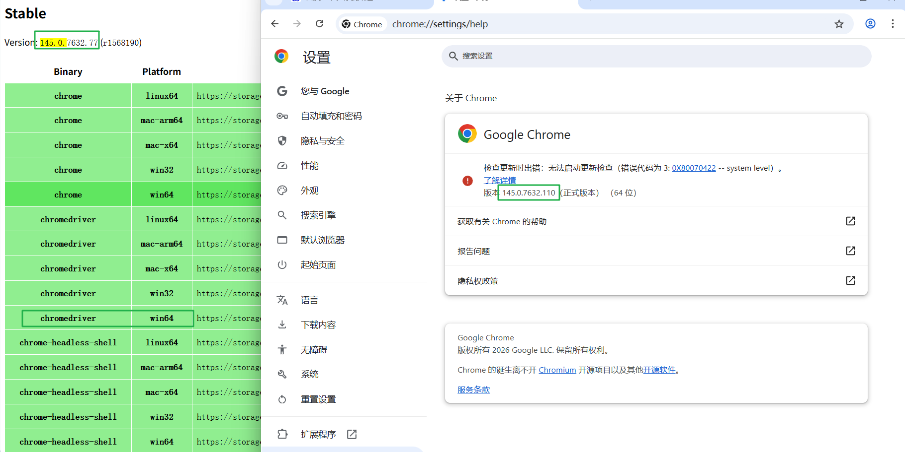
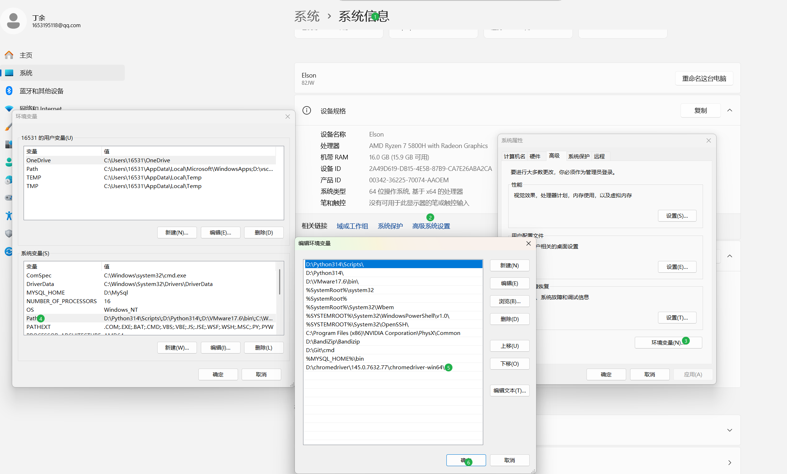

### Selenium

##### 1. 配置

- ###### 下载对应浏览器的驱动



驱动下载路径：https://googlechromelabs.github.io/chrome-for-testing

- ###### 配置系统环境

只添加目录，再添加期间，建议关闭写代码的工具，例如pycharm vscode



配置完毕。

##### 2. Day01

```python
# 用于启动激活浏览器
from selenium import webdriver 
# 配置chrome浏览器的显示格式
from selenium.webdriver.chrome.options import Options
# 用于获取网页元素 ID class 
from selenium.webdriver.common.by import By
# 等待操作
from selenium.webdriver.support.ui import WebdirverWait
# 期望某个元素出现
from selenium.webdriver.support import expected_conditions as EC
# 为了更好的页面展示和元素获取
from time import time


# 配置chrome浏览器要显示时的配置
options=Options()
# 最大化显示窗口
options.add_argument("--star-maximized")
# 最小化窗口
# options.add_argument("--star-minimized")
# 防止其他弹窗阻碍
options.add_argument("--disable-blink-features=AutomationControlled")
# 激活chrome浏览器
driver=webdriver.chrome(options=options) 


try:
    # 进入对应网址
    driver.get(r"www.baidu.com")
    # 创建元素等待器
    wait=WebDriverWait(dirver,10)
    # 期望元素
    ec_element1=EC.element_to_be_clickable((By.ID,"chat-textarea"))
    # 等待与期望元素结合，真实实现了该元素
    real_element1=wait.until(ec_element1)
    # 由于该元素是文本元素，所以先聚焦
    real_element1.click()
    # 清空原有文本
    real_element.clear()
    # 对文本元素输入文本
    real_element.send_keys("追觅")

    # 真正实现点击元素和方法.click()，由于已创建时间等待元素wait，只需要创建期望元素(点击元素)
    ec_element2=EC.element_to_be_clickable((By.ID,"chat-submit-button"))
    # 实现真实可点击元素
    real_element2=wait.until(ec_element2)
    # 前面已经输入文本，现在实现点击“百度一下”功能
    real_element2.click()
    # 等待几秒显示浏览器页面
    sleep(3)
except Exception as e:
    print(f"有问题,问题是：{e}")
   	# 当出错是，系统截图，为了更好的定位在哪一步
    driver.screen_shot("error_screenshot/rror_screenshot.png")
finally:
    print("不管程序执行失败还是成功，我们都需要关闭浏览器，防止内存溢出")
    driver.close()
```

过程：配置对应浏览器 --> 激活浏览器 --> 进入对应网址 --> 创建真实元素（wait+ec_elements）--> 操作元素 --> 关闭浏览器

##### 3. driver 方法

get(url) 进入对应网页；save_screenshot(./screenshot.png) 失败截图；quit() 关闭浏览器；title() 返回主题

##### 4. 真实元素方法

click() 点击；clear() 清除文本；send_keys("文本") 向文本框发送文本；is_displayed()用户是否可见(搜索框 按钮)

##### 5.  EC方法

- ###### element_to_be_clickable((By.ID,"id")) 元素可见也能够被点击（最有用）

- ###### element_to_be_present() 等待元素出现，但不会点击（可能被隐藏）

- ###### visibility_of_element_located() 元素是可见的（不管能不能点击），可见不代表能够点击

- ###### presence_of_element_located() 元素已经存在DOM中，但是不可见

- ###### title_contains() 标题是否含有什么关键字，取决于你搜索的什么，是否进入该主题（判断）

##### 6. By 定位

- ID 唯一的且直接定位
- NAME 某个元素拥有属性，name="wc"
- XPATH eg : //*/div[@id="yes" and @class="no"]/parent::div/a[contians(text(),"新闻")]/following-sibling::*[1]
- CSS eg : div#yes>div.no a
- LINK_TEXT 精确文本匹配
- PARTIAL_LINK 模糊匹配
- CLASS_NAME 属性值匹配
- TAG_NAME 元素值匹配

##### 7. Day02

```python
# 打印完整库
import traceback
from time import sleep
from selenium import webdriver
from selenium.webdriver.chrome.options import Options
from selenium.webdriver.common.by import By
from selenium.webdriver.support.ui import WebDriverWait
from selenium.webdriver.support import expected_conditions as EC

from selenium.common.exceptions import TimeoutException,NoSuchElementException
# 动作链
from selenium.webdriver.common.action_chains import ActionChains

def by_method_located_text(wait,located):
    print(f'现在正在使用{repr(located[0])}进行搜索文本框')
    real_element=wait.until(EC.visibility_of_element_located(located))
    real_element.click()
    real_element.clear()
    print(str(located[0]))
    real_element.send_keys(f"{repr(located[0])}")
    sleep(1)
    real_element.clear()
    # 点击空白处使得后续地图能够被选中
    wait.until(EC.visibility_of_element_located((By.TAG_NAME,"body"))).click()


def by_method_located(wait,located):
    print(f'现在正在使用{repr(located[0])}进行搜索文本框')
    real_element=wait.until(EC.visibility_of_element_located(located))
    if real_element:
        print(real_element,real_element.text)
    print(f'我已经找到了{real_element.text}')
    sleep(1)


def main():
    driver=None
    try:
        options=Options()
        options.add_argument("--start-maximized")
        options.add_argument("--disable-blink-features=AutomationControlled")
        driver=webdriver.Chrome(options=options)
        driver.get("https://www.baidu.com".strip())
        wait=WebDriverWait(driver,10)

        # 创建定位器
        located_id=(By.ID,"chat-textarea")
        located_class_name=(By.CLASS_NAME,"chat-input-textarea")
        located_xpath=(By.XPATH,'//div[@id="chat-input-area"]/textarea')
        located_css=(By.CSS_SELECTOR,'#chat-input-area textarea')

        located_link_text=(By.LINK_TEXT,'更多')
        located_partial_text=(By.PARTIAL_LINK_TEXT,'地')

        by_method_located(wait,located_link_text)
        by_method_located(wait,located_partial_text)
        by_method_located_text(wait,located_id)
        by_method_located_text(wait,located_class_name)
        by_method_located_text(wait,located_xpath)
        by_method_located_text(wait,located_css)
    # 超时异常
    except TimeoutException as e:
        print(e)
    # 未定义到元素异常
    except NoSuchElementException as e:
        print(e)
    except Exception as e:
        if driver:
            driver.save_screenshot("./error_screenshot/error_screenshot.png")
            print(e)
        traceback.print_exc() # 打印完整堆栈，方便调试
    finally:
        driver.quit()


if __name__=="__main__":
    main()


```

##### 8. 等待

- ###### 强制等待（time.sleep()）

- ###### 隐式等待（driver.implicitly_wait(10)）全局设置，找元素时最多轮寻10秒

- ###### 显示等待（WebDriverWait(driver,10,0.5).until(EC.presence_of_element_located((By.ID,"wc")))）

#### 常用方法：

assert 判断条件,"报错字符串"

```python
try:
	pass
except Exception as e:
	print(e)
finally:
	pass
```

```Python
import os
os.makedirs(./dir1,exists_ok=True) # 存在则不创建
```

